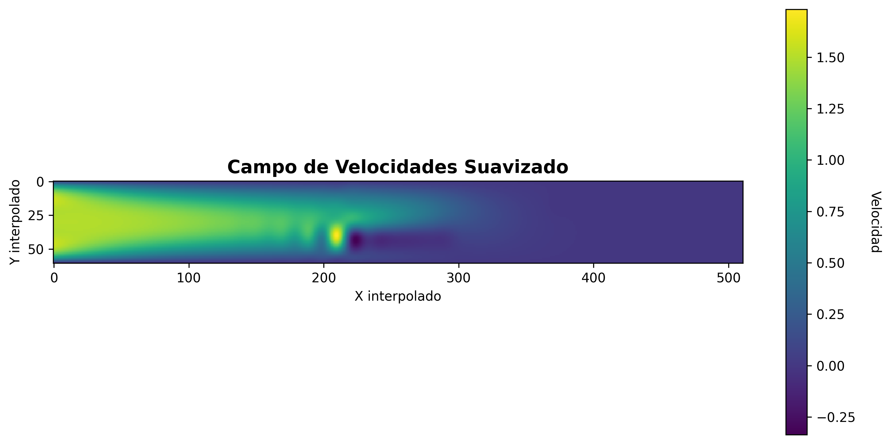

# 🌊 Simulación de Flujo Laminar 2D

Simulación numérica de flujo laminar incompresible alrededor de obstáculos utilizando las ecuaciones de Navier-Stokes simplificadas, resueltas mediante el método de **Newton-Raphson** con **Gradiente Conjugado**.

<p align="center">
  
</p>

## 📋 Descripción

Este proyecto implementa una simulación de flujo de fluido 2D en un canal rectangular con dos obstáculos sólidos (vigas). El modelo está basado en el problema propuesto en **Landau & Páez, "Computational Problems for Physics"** (Cap. 4.6: Hidrodinámica - Navier-Stokes, viga sumergida).

### Características principales:

- **Modelo fijo:** La geometría del canal y posición de los obstáculos están predefinidos según el problema de referencia
- **Datos iniciales automáticos:** Los valores iniciales de velocidad se generan automáticamente mediante un algoritmo que simula el comportamiento físico esperado (velocidades decrecientes de entrada a salida)
- **Discretización espacial:** Diferencias finitas centradas
- **Solver no lineal:** Método de Newton-Raphson
- **Solver lineal interno:** Gradiente Conjugado con transformación SPD (J^T J)
- **Post-procesamiento:** Interpolación con splines cúbicos bidimensionales

## 🏗️ Geometría del Problema (Modelo Fijo)

```
         ← 400 unidades →
    ┌─────────────────────────────────┐  ↑
    │                        ████████ │  │
    │                        ████████ │  │
u=1 │      ████████                   │  40
→   │      ████████                   │  │
    │                                 │  │
    └─────────────────────────────────┘  ↓
                                      u=0
```

| Parámetro | Valor |
|-----------|-------|
| Dominio | 400 × 40 unidades |
| Bloque superior | (296, 400) × (32, 40) |
| Bloque inferior | (176, 232) × (1, 16) |
| Paso de discretización | h = 8 |
| Malla resultante | 52 × 7 nodos |

> **Nota:** Estos valores están fijos en el código según el problema de referencia de Landau & Páez.

## 🚀 Instalación y Uso

### Requisitos

```bash
pip install numpy matplotlib scipy
```

### Ejecución

```bash
python malla.py
```

El programa ejecuta automáticamente todo el proceso de simulación sin necesidad de configuración adicional.

---

## 📦 Documentación de Clases y Funciones

### Clase `Bloque`

Representa un obstáculo sólido rectangular en el dominio.

```python
bloque = Bloque(x0, xn, y0, yn)
```

| Parámetro | Tipo | Descripción |
|-----------|------|-------------|
| `x0` | int | Coordenada X inicial (física) |
| `xn` | int | Coordenada X final (física) |
| `y0` | int | Coordenada Y inicial (física) |
| `yn` | int | Coordenada Y final (física) |

**Métodos:**
- `procesar_bloque_en_malla(h, Ny)`: Convierte coordenadas físicas a índices de malla

---

### Clase `Malla`

Gestiona el dominio computacional, condiciones de frontera y generación de valores iniciales.

```python
malla = Malla(Lx, Ly, h, v0, bloqueSuperior, bloqueInferior, divH, divV)
```

| Parámetro | Tipo | Descripción |
|-----------|------|-------------|
| `Lx` | int | Longitud del dominio en X |
| `Ly` | int | Longitud del dominio en Y |
| `h` | int | Paso de discretización |
| `v0` | float | Velocidad en la entrada (frontera izquierda) |
| `bloqueSuperior` | Bloque | Obstáculo superior |
| `bloqueInferior` | Bloque | Obstáculo inferior |
| `divH` | int | Divisiones horizontales para valores iniciales |
| `divV` | int | Divisiones verticales para valores iniciales |

**Métodos:**
| Método | Descripción |
|--------|-------------|
| `retornar_malla()` | Devuelve la matriz NumPy de la malla |
| `guardar_matriz_txt(archivo)` | Guarda la matriz en archivo de texto |
| `visualizar_malla(titulo, guardar, archivo)` | Genera visualización con mapa de calor |

**Generación automática de valores iniciales:**
La clase genera automáticamente valores iniciales que:
- Decrecen de izquierda a derecha (simulando pérdida de velocidad)
- Decrecen de arriba a abajo (perfil de velocidad)
- Incluyen componente aleatoria controlada para evitar simetrías artificiales

---

### Clase `Vector`

Implementa el método de Newton-Raphson con Gradiente Conjugado.

```python
vector = Vector(matriz_malla)
```

| Parámetro | Tipo | Descripción |
|-----------|------|-------------|
| `matriz_malla` | ndarray | Matriz 2D con valores iniciales |

**Atributos:**
| Atributo | Descripción |
|----------|-------------|
| `vec` | Vector de incógnitas (malla aplanada) |
| `vectFunction` | Vector de residuales F(X) |
| `matrixJacobiana` | Matriz Jacobiana J(X) |
| `filas`, `columnas` | Dimensiones de la malla |

**Métodos:**
| Método | Descripción |
|--------|-------------|
| `cal_function(malla_obj)` | Calcula el vector de residuales F(X) |
| `cal_jacobiano(malla_obj)` | Calcula la matriz Jacobiana J(X) |
| `actualizar_newton(A, b, verbose)` | Resuelve con Gradiente Conjugado y actualiza X |
| `mostrar_matriz(en_consola)` | Imprime la malla en consola |
| `mostrar_mapa_calor(detallado)` | Visualiza campo de velocidades |

---

### Funciones de Análisis

```python
es_diagonalmente_dominante(A, strict=False)
```
Verifica si una matriz es diagonalmente dominante. Retorna `(bool, fila, diag, off)`.

```python
visualizar_jacobiano_heatmap(jacobiana, guardar=True, nombre_archivo="jacobiano_heatmap.png")
```
Genera mapa de calor de la matriz Jacobiana con estadísticas.

```python
visualizar_malla_inicial(malla, guardar=True, nombre_archivo="seleccion_valores_iniciales.png")
```
Visualiza los valores iniciales generados automáticamente.

---

### Funciones de Interpolación

```python
interpolador = construir_interpolador_superficie(matriz)
```
Construye un spline cúbico bidimensional (`RectBivariateSpline`) a partir de la matriz de resultados.

```python
matriz_suave, x_nuevo, y_nuevo = generar_matriz_suavizada(interpolador, filas, columnas, factor=10)
```
Evalúa el interpolador en una malla refinada (factor × más puntos).

```python
mostrar_mapa_suavizado(matriz, titulo, guardar, nombre_archivo)
```
Renderiza el campo de velocidades suavizado.

```python
visualizar_superficie_3d(interpolador, filas, columnas, factor=10, guardar=True)
```
Genera superficie 3D de la función de interpolación.

```python
visualizar_cortes_spline(interpolador, filas, columnas, factor=10, guardar=True)
```
Genera 4 gráficos: perfiles horizontales, verticales, contornos e isolíneas.

---

## 🔄 Proceso Principal (`main()`)

El flujo de ejecución es el siguiente:

```
┌─────────────────────────────────────────────────────────────────┐
│                         INICIO                                  │
└─────────────────────────────────────────────────────────────────┘
                              │
                              ▼
┌─────────────────────────────────────────────────────────────────┐
│  1. DEFINICIÓN DE GEOMETRÍA                                     │
│     • Crear bloques (obstáculos) con coordenadas fijas          │
│     • bloqueSuperior = Bloque(296, 400, 32, 40)                │
│     • bloqueInferior = Bloque(176, 232, 1, 16)                 │
└─────────────────────────────────────────────────────────────────┘
                              │
                              ▼
┌─────────────────────────────────────────────────────────────────┐
│  2. GENERACIÓN AUTOMÁTICA DE MALLA                              │
│     • Crear malla con Malla(400, 40, h=8, ...)                 │
│     • Valores iniciales generados automáticamente               │
│     • Aplicar condiciones de frontera                           │
│     • Visualizar: seleccion_valores_iniciales.png              │
└─────────────────────────────────────────────────────────────────┘
                              │
                              ▼
┌─────────────────────────────────────────────────────────────────┐
│  3. INICIALIZAR VECTOR PARA NEWTON-RAPHSON                      │
│     • vector = Vector(malla.retornar_malla())                  │
│     • Convertir matriz 2D → vector 1D                          │
└─────────────────────────────────────────────────────────────────┘
                              │
                              ▼
┌─────────────────────────────────────────────────────────────────┐
│  4. CICLO DE NEWTON-RAPHSON                                     │
│     ┌─────────────────────────────────────────────────────────┐│
│     │  Para cada iteración k = 1, 2, ..., max_iter:          ││
│     │                                                         ││
│     │  a) Calcular residual: F(X^k)                          ││
│     │  b) Verificar convergencia: ||F|| < tol                ││
│     │  c) Calcular Jacobiano: J(X^k)                         ││
│     │  d) Transformar a SPD: A = J^T·J, b = -J^T·F           ││
│     │  e) Resolver con Gradiente Conjugado: A·H = b          ││
│     │  f) Actualizar: X^(k+1) = X^k + H                      ││
│     │  g) Verificar cambio: ||X^(k+1) - X^k|| < tol          ││
│     └─────────────────────────────────────────────────────────┘│
│     • En iteración 1: Visualizar jacobiano_heatmap.png         │
└─────────────────────────────────────────────────────────────────┘
                              │
                              ▼
┌─────────────────────────────────────────────────────────────────┐
│  5. VISUALIZACIÓN DE RESULTADOS                                 │
│     • Mostrar campo de velocidades (mapa de calor)             │
│     • Mostrar valores en consola                                │
└─────────────────────────────────────────────────────────────────┘
                              │
                              ▼
┌─────────────────────────────────────────────────────────────────┐
│  6. INTERPOLACIÓN Y SUAVIZADO                                   │
│     • Construir spline cúbico bidimensional                    │
│     • Generar: spline_superficie_3d.png                        │
│     • Generar: spline_cortes.png                               │
│     • Generar: malla_suavizada.png                             │
└─────────────────────────────────────────────────────────────────┘
                              │
                              ▼
┌─────────────────────────────────────────────────────────────────┐
│                          FIN                                    │
└─────────────────────────────────────────────────────────────────┘
```

---

## 📊 Resultados Generados

| Archivo | Descripción |
|---------|-------------|
| `seleccion_valores_iniciales.png` | Valores iniciales (generados automáticamente) |
| `jacobiano_heatmap.png` | Estructura de la matriz Jacobiana |
| `spline_superficie_3d.png` | Superficie 3D del campo interpolado |
| `spline_cortes.png` | Perfiles de velocidad (cortes del spline) |
| `malla_suavizada.png` | Campo de velocidades final suavizado |

## 📐 Parámetros Globales

```python
H_DISCRETIZACION = 8       # Paso de discretización espacial (fijo)
VY_COMPONENTE = -0.000005  # Componente vertical de velocidad (fijo)
```

## 🧮 Método Numérico

### Ecuación Discretizada

Para cada nodo interno, la ecuación de convección-difusión discretizada es:

$$F_{idx} = -X_{idx} + \frac{1}{4}\left( X_{idx+1} + X_{idx-1} + X_{idx+N} + X_{idx-N} - 4X_{idx}(X_{idx+1} - X_{idx-1}) - 4V_y(X_{idx-N} - X_{idx+N}) \right)$$

### Criterios de Convergencia

| Criterio | Valor |
|----------|-------|
| Norma del residual | $\|\mathbf{F}\| < 10^{-10}$ |
| Cambio entre iteraciones | $\|\Delta\mathbf{X}\| < 10^{-8}$ |
| Máximo de iteraciones | 200 |

## 📚 Referencias

- **Landau & Páez**, *Computational Problems for Physics*, CRC Press, 2018 — **Modelo base del problema**
- Press et al., *Numerical Recipes*, Cambridge University Press, 2007
- Kincaid & Cheney, *Numerical Analysis*, Brooks/Cole, 2002
- Shewchuk, *An Introduction to the Conjugate Gradient Method*, 1994

## 👥 Autores

| Nombre | Código |
|--------|--------|
| Juan David Rincón | 2342032 |
| Maria Juliana Saavedra | 2344035 |
| Libardo Alejandro Quintero | 2342181 |

Proyecto desarrollado para el curso de **Simulación y Computación Numérica**  
Profesora: María Patricia Trujillo  
Universidad del Valle - Semestre 2025-II

## 📄 Licencia

Este proyecto es de uso académico.
